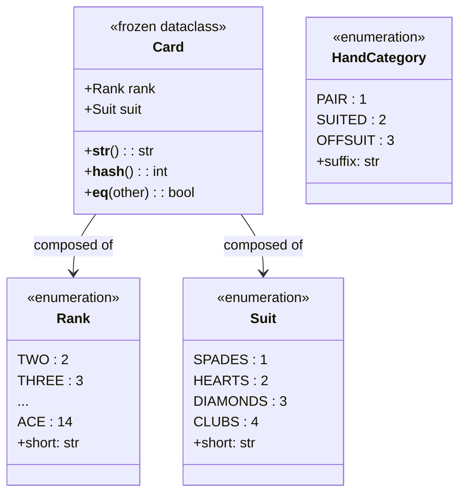

# Specification 01: Preflop Poker Mechanics & Canonical Hand Representation

**Module:** `src/hand.py`  
**Domain:** Texas Hold'em Combinatorics & Card Abstraction  
**Author:** Senior AI Research Engineer & CS Faculty  
**Audience:** 1st-Year Computer Science / AI Students  

---

## 1. Executive Summary & Domain Problem

In Texas Hold'em, every player is dealt two private hole cards from a standard 52-card deck. A brute-force simulation or Game Theory Optimal (GTO) solver that analyzes hands at the raw 52-card physical level must deal with **1,326 possible starting deals**.

However, before any community cards are revealed (preflop), suits are completely symmetric in Texas Hold'em (a spade holds no inherent dominance over a heart). Because of this rotational suit symmetry (suit isomorphism), we can partition the 1,326 raw combinations into an **equivalence relation** consisting of exactly **169 canonical hand categories** (e.g., $AKs$, $AKo$, $AA$).

This specification mathematically defines the card domain, proves why exactly 169 canonical hands exist, and details the data structures and algorithms required to represent and classify them with $O(1)$ time complexity.

---

## 2. Discrete Mathematics & Combinatorics

### 2.1 The Standard 52-Card Deck as a Cartesian Product

Let the set of all card ranks $R$ and the set of all card suits $S$ be defined as:
$$\begin{aligned}
R &= \{2, 3, 4, 5, 6, 7, 8, 9, T, J, Q, K, A\}, \quad |R| = 13 \\
S &= \{\spadesuit, \heartsuit, \diamondsuit, \clubsuit\}, \quad |S| = 4
\end{aligned}$$

The deck of cards $C$ is the Cartesian product $C = R \times S$:
$$|C| = |R| \times |S| = 13 \times 4 = 52$$

### 2.2 Total Raw 2-Card Combinations (Hole Cards)

A starting hand is an unordered selection of 2 distinct cards from $C$ without replacement:
$$\binom{|C|}{2} = \binom{52}{2} = \frac{52 \times 51}{2 \times 1} = 1,326 \text{ raw combinations}$$

---

### 2.3 The Equivalence Partitioning into 169 Canonical Hands

Because suits have identical rules in poker, any two hands that share the same two ranks and the same "suit relationship" (both same suit vs. different suits) have identical equity preflop against random hands.

We partition all 1,326 hands into 3 mutually exclusive, collectively exhaustive categories:

```
                          ┌─────────────────────────────┐
                          │   Total Raw Deals: 1,326    │
                          └──────────────┬──────────────┘
                 ┌───────────────────────┼───────────────────────┐
                 ▼                       ▼                       ▼
       ┌───────────────────┐   ┌───────────────────┐   ┌───────────────────┐
       │   Pocket Pairs    │   │   Suited Hands    │   │   Offsuit Hands   │
       │     (Rank1 == Rank2)│   │   (Rank1 != Rank2)│   │   (Rank1 != Rank2)│
       │                   │   │   (Suit1 == Suit2)│   │   (Suit1 != Suit2)│
       └─────────┬─────────┘   └─────────┬─────────┘   └─────────┬─────────┘
                 │                       │                       │
      13 Canonical Ranks      78 Canonical Pairs      78 Canonical Pairs
       × 6 Suit Combos         × 4 Suit Combos         × 12 Suit Combos
       = 78 Raw Combos         = 312 Raw Combos        = 936 Raw Combos
                 │                       │                       │
                 └───────────────────────┼───────────────────────┘
                                         ▼
                            13 + 78 + 78 = 169 Classes
                            78 + 312 + 936 = 1,326 Checks
```

#### Category A: Pocket Pairs ($r_1 = r_2$)
- **Canonical Hand Count:** $\binom{13}{1} = 13$ distinct pair ranks ($AA, KK, QQ, \dots, 22$).
- **Combinations per Pair:** Choosing 2 suits out of 4:
  $$\binom{4}{2} = \frac{4 \times 3}{2} = 6 \text{ combinations}$$
  *(e.g., $A\spadesuit A\heartsuit, A\spadesuit A\diamondsuit, A\spadesuit A\clubsuit, A\heartsuit A\diamondsuit, A\heartsuit A\clubsuit, A\diamondsuit A\clubsuit$)*
- **Total Raw Combinations:** $13 \times 6 = 78$.

#### Category B: Suited Hands ($r_1 \neq r_2$, $s_1 = s_2$)
- **Canonical Hand Count:** Choosing 2 distinct ranks out of 13:
  $$\binom{13}{2} = \frac{13 \times 12}{2} = 78 \text{ distinct suited hands } (AKs, AQs, \dots, 32s)$$
- **Combinations per Suited Hand:** Choosing 1 common suit out of 4:
  $$\binom{4}{1} = 4 \text{ combinations } (\spadesuit\spadesuit, \heartsuit\heartsuit, \diamondsuit\diamondsuit, \clubsuit\clubsuit)$$
- **Total Raw Combinations:** $78 \times 4 = 312$.

#### Category C: Offsuit Hands ($r_1 \neq r_2$, $s_1 \neq s_2$)
- **Canonical Hand Count:** Choosing 2 distinct ranks out of 13:
  $$\binom{13}{2} = \frac{13 \times 12}{2} = 78 \text{ distinct offsuit hands } (AKo, AQo, \dots, 32o)$$
- **Combinations per Offsuit Hand:** Selecting 2 distinct suits where order matters between the two distinct ranks ($4 \times 3$):
  $$4 \times 3 = 12 \text{ combinations}$$
- **Total Raw Combinations:** $78 \times 12 = 936$.

#### Total Conservation Check:
$$\text{Canonical Classes} = 13 + 78 + 78 = 169$$
$$\text{Raw Combinations} = 78 + 312 + 936 = 1,326$$

---

## 3. Real-World Mental Models & Analogies

### Analogy 1: The $13 \times 13$ Strategic Matrix

Imagine a 2-dimensional $13 \times 13$ table where both rows and columns are ordered by rank from **Ace (highest) down to 2 (lowest)**:

$$\begin{array}{c|c c c c c c}
  & \mathbf{A} & \mathbf{K} & \mathbf{Q} & \mathbf{J} & \dots & \mathbf{2} \\
\hline
\mathbf{A} & \mathbf{AA} & AKs & AQs & AJs & \dots & A2s \\
\mathbf{K} & AKo & \mathbf{KK} & KQs & KJs & \dots & K2s \\
\mathbf{Q} & AQo & KQo & \mathbf{QQ} & QJs & \dots & Q2s \\
\mathbf{J} & AJo & KJo & QJo & \mathbf{JJ} & \dots & J2s \\
\vdots & \vdots & \vdots & \vdots & \vdots & \ddots & \vdots \\
\mathbf{2} & A2o & K2o & Q2o & J2o & \dots & \mathbf{22} \\
\end{array}$$

1. **The Main Diagonal (Top-Left to Bottom-Right):**
   - Coordinates where $\text{row} = \text{column}$.
   - Represents all **13 Pocket Pairs** ($AA, KK, \dots, 22$).
2. **The Upper Triangle (Above the Diagonal):**
   - Represents all **78 Suited Hands** ($AKs, AQs, \dots, 32s$).
   - Standard convention: the row rank is higher than the column rank, followed by `'s'`.
3. **The Lower Triangle (Below the Diagonal):**
   - Represents all **78 Offsuit Hands** ($AKo, AQo, \dots, 32o$).
   - Standard convention: the column rank is higher than the row rank, followed by `'o'`.

**Total Cells in Matrix:** $13 \times 13 = 169$. Every cell represents exactly one canonical hand.

---

### Analogy 2: The Physical 169-Slot Card Sorter Tray

Imagine you work in a casino sorting room. A machine deals out all 1,326 possible two-card combinations one by one. You have a mail sorter desk with **169 labeled slots**:
- When the machine hands you $A\spadesuit A\heartsuit$, you drop it into the slot labeled `AA`.
- When the machine hands you $A\diamondsuit A\clubsuit$, you drop it into the same `AA` slot. By the end, the `AA` slot contains 6 physical card pairs.
- When the machine hands you $K\spadesuit A\spadesuit$, you recognize they are suited, order the higher rank first ($A$ before $K$), and drop it into `AKs`. That slot will accumulate 4 card pairs.
- When the machine hands you $7\heartsuit 2\clubsuit$, you drop it into `72o`. That slot will accumulate 12 card pairs.

---

## 4. Software Architecture & Data Structures

To build high-performance poker simulation and AI systems, representation must be both computationally lightweight and strictly typed.



### 4.1 `Rank` (Enum)
- **Values:** Integers `2` through `14` (Ace is high in preflop Hold'em).
- **Property `short`:** Single-character symbol: `'2'`, `'3'`, ..., `'9'`, `'T'`, `'J'`, `'Q'`, `'K'`, `'A'`.
- **Time Complexity:** Value comparison and ordering are $O(1)$.

### 4.2 `Suit` (Enum)
- **Values:** `1` (Spades), `2` (Hearts), `3` (Diamonds), `4` (Clubs).
- **Property `short`:** `'s'`, `'h'`, `'d'`, `'c'`.

### 4.3 `Card` (Frozen Dataclass)
- Immutable struct combining `(rank: Rank, suit: Suit)`.
- Being `frozen=True` auto-generates `__hash__` and `__eq__`, allowing Cards to be stored in hash sets ($O(1)$ lookup for collision detection, deck depletion, and dead cards).

### 4.4 `HandCategory` (Enum)
- Values: `PAIR` (suffix `""`), `SUITED` (suffix `"s"`), `OFFSUIT` (suffix `"o"`).

---

## 5. Core Algorithms & Canonicalization Logic

### 5.1 `classify_hand(card1: Card, card2: Card) -> str`
Takes two arbitrary `Card` instances and maps them to their canonical 169-hand string representation.

```
Algorithm: classify_hand(card1, card2)
1. Assert card1 is not card2 (physical identity check).
2. Rank Ordering:
   If card1.rank.value >= card2.rank.value:
       high_rank <- card1.rank
       low_rank  <- card2.rank
   Else:
       high_rank <- card2.rank
       low_rank  <- card1.rank
3. Category Identification:
   If high_rank == low_rank:
       category <- PAIR
   Else if card1.suit == card2.suit:
       category <- SUITED
   Else:
       category <- OFFSUIT
4. Return string concatenation: high_rank.short + low_rank.short + category.suffix
```

- **Time Complexity:** $O(1)$ — fixed integer comparisons and string formatting.
- **Space Complexity:** $O(1)$ — auxiliary memory is constant.

---

### 5.2 `generate_all_169_hands() -> List[str]`
Generates the complete set of 169 canonical preflop hand strings in a deterministic ordering.

```
Algorithm: generate_all_169_hands()
1. Let result be an empty set of strings.
2. For each rank r in Rank:
       result.add(r.short + r.short)          // 13 Pairs
3. For i from 0 to len(Rank) - 1:
       For j from i + 1 to len(Rank) - 1:
           high <- Rank[i] (or Rank[j], whichever is higher in value)
           low  <- the other rank
           result.add(high.short + low.short + "s")  // 78 Suited
           result.add(high.short + low.short + "o")  // 78 Offsuit
4. Return sorted(result)
```

- **Time Complexity:** $O(|R|^2) = O(13^2) = O(169) \implies O(1)$ constant runtime.
- **Space Complexity:** $O(169)$ strings $\implies O(1)$ constant auxiliary space.

---

## 6. Verification Invariants & Quality Gates

Any implementation of `src/hand.py` must satisfy the following mathematical invariants verified by automated tests:

1. **Card Invariant:** Exactly $13 \times 4 = 52$ unique cards exist in a full deck.
2. **Canonical Output Invariant:** For any valid pair of cards $(c_1, c_2)$, `classify_hand(c1, c2) == classify_hand(c2, c1)`.
3. **Partition Completeness:**
   - Total generated hands = $169$.
   - Unique generated hands (`len(set(hands))`) = $169$.
   - Number of pairs (length 2) = $13$.
   - Number of suited hands (ends with `'s'`) = $78$.
   - Number of offsuit hands (ends with `'o'`) = $78$.
4. **Collision Invariant:** `classify_hand(c, c)` MUST raise `ValueError` (a single physical card cannot be paired with itself).

